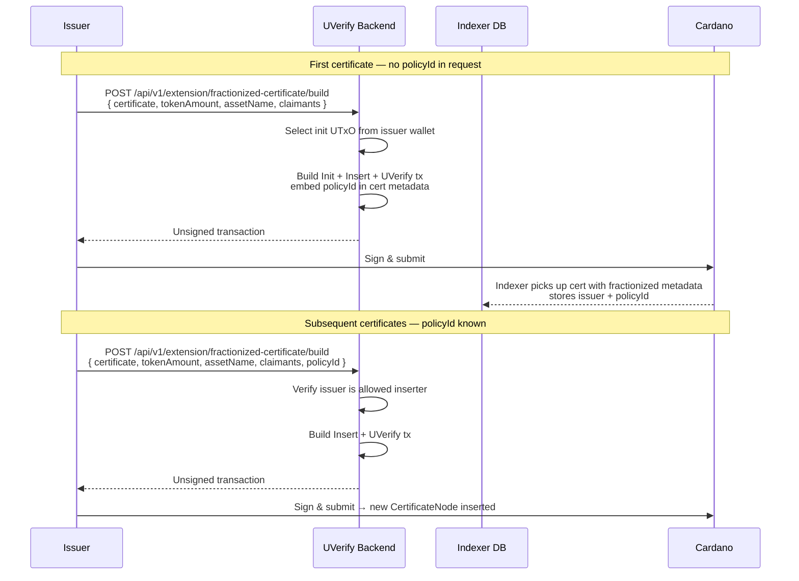
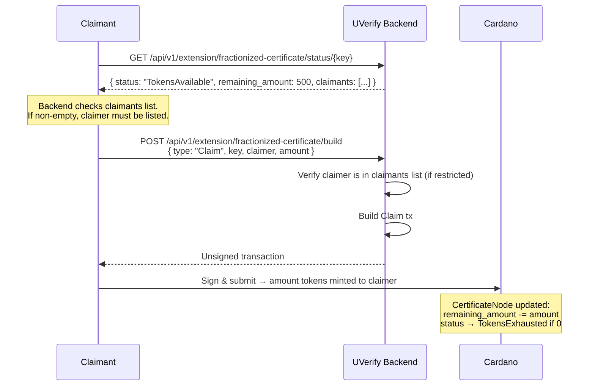
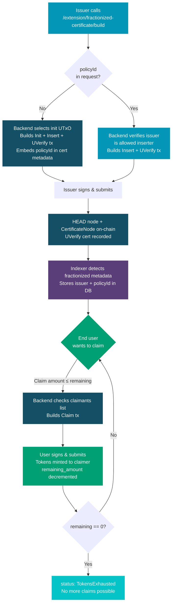

# Fractionized Certificate 🪙

A Fractionized Certificate lets you attach a fixed supply of **fungible tokens** to a UVerify certificate. The issuer mints a node that holds `total_amount` tokens; one or more claimants can then each call `Claim` to receive a portion of that supply. The node stays on-chain and tracks how many tokens remain until the supply is exhausted.

Typical use cases:

- **Renewable attribute certifications** in the oil or recycling industry, where a certificate represents a verified sustainability claim and end users can claim incentive tokens as proof of their contribution
- **Dividend or revenue-share distributions** where a certificate proves eligibility
- **Loyalty programmes** where a brand certificate unlocks a fungible reward

## Lifecycle

There are two on-chain actions:

| Action | Who calls it | What happens |
|--------|-------------|--------------|
| `Issue Certificate` | Certificate Issuer | Mints a node token and inserts a new `CertificateNode` into the linked list (creating the list first if no policy ID is provided), and atomically anchors the UVerify certificate hash on-chain in the same transaction |
| `Claim` | Claimant (must sign with their key) | Mints `amount` fungible tokens to the claimer; decrements `remaining_amount`; sets status to `TokensExhausted` when supply hits zero |

## Issuer Flow

All certificate issuance goes through the single endpoint `POST /api/v1/extension/fractionized-certificate/build` — **not** through the standard `/api/v1/transaction/build`. The backend decides what to build based on whether a `policyId` is included in the request.

### First certificate — no existing policy

When the issuer omits `policyId`, the backend bootstraps everything in one shot:

1. Selects a UTxO from the issuer's wallet to use as the one-time init UTxO (this makes the policy ID unique and non-reusable).
2. Builds a combined transaction that:
   - Initialises a new linked-list HEAD node (`CertificateInit`), making the issuer the admin / only allowed inserter.
   - Immediately inserts the first certificate as a node (`CertificateInsert`).
   - Anchors the certificate hash on-chain via the UVerify state validator.
   - Embeds the generated **policy ID** in the certificate metadata so it can be discovered later.
3. Returns a single unsigned transaction — the issuer signs and submits once.

The backend's **scoped indexer** watches for UVerify certificates that carry a fractionized extension marker in their metadata. When it finds one, it stores the issuer's key and the policy ID in the database, making the linked list discoverable for future inserts and claims.

### Subsequent certificates — existing policy

When the issuer provides a `policyId`, the backend:

1. Verifies the issuer is an allowed inserter for that linked list.
2. Builds a combined transaction that issues the UVerify certificate and inserts a new node into the existing list.
3. Returns a single unsigned transaction — the issuer signs and submits.



### EUTXO contention

If two inserts race on the same predecessor node, the backend automatically rebuilds the losing transaction using a **fork-and-orphan** strategy so neither transaction is lost.

## Claimant Flow

Anyone listed in `claimants` (or anyone at all if the list is empty) can call `Claim` against a node with `status: TokensAvailable`.



### Validator rules enforced on Claim

- `amount > 0` and `amount ≤ remaining_amount`
- The claimer must sign the transaction.
- If `claimants` is non-empty, only listed keys may claim.
- The minted token quantity must exactly equal `amount`.
- The node UTxO is spent and recreated with the updated `remaining_amount` and `status`.

## Full End-to-End Flow



## API Reference

### Build Transaction

```
POST /api/v1/extension/fractionized-certificate/build
```

**First certificate (no existing policy — backend creates the linked list)**
```json
{
  "certificate": { ... },
  "tokenAmount": 1000,
  "assetName": "RecyclingCredit",
  "claimants": ["<vkh1>", "<vkh2>"]
}
```

The response includes the generated `policyId`. Store it to reference this linked list in future requests.

**Subsequent certificates (existing policy)**
```json
{
  "certificate": { ... },
  "tokenAmount": 500,
  "assetName": "RecyclingCredit",
  "claimants": [],
  "policyId": "<policy_id>"
}
```

**Claim**
```json
{
  "type": "Claim",
  "key": "<certificate_hash>",
  "policyId": "<policy_id>",
  "claimer": "<verification_key_hash>",
  "amount": 50
}
```

All responses are unsigned CBOR transactions that must be signed by the appropriate key and submitted to the network.

### Query Node Status

```
GET /api/v1/extension/fractionized-certificate/status/{key}?policyId=...
```

Returns the current on-chain state of the node, including `remaining_amount`, `claimants`, and `status`.
