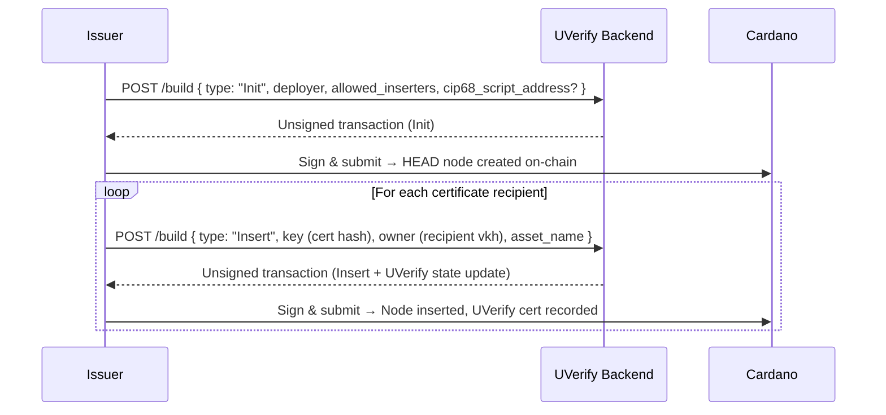
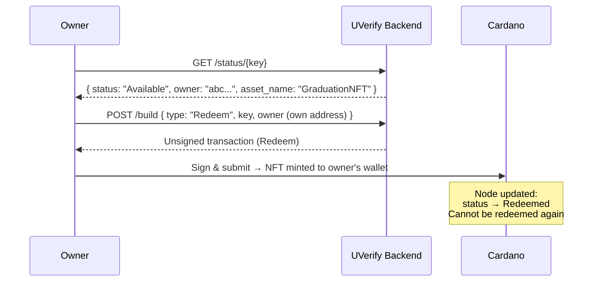
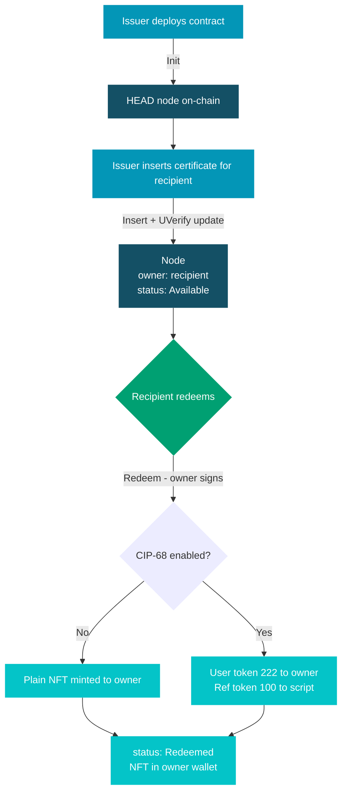

# Tokenizable Certificate 🎫

A Tokenizable Certificate attaches a **unique NFT** to a UVerify certificate. Each certificate node is assigned a designated owner; that owner can redeem the node exactly once to receive their token. The node status permanently flips to `Redeemed` afterward, making double-claims impossible.

Optional [CIP-68](https://github.com/cardano-foundation/CIPs/tree/master/CIP-0068) support allows the minted token to carry rich on-chain metadata via a reference token stored at a separate script address.

Typical use cases:

- **Diploma or credential NFTs** — the university issues the node; the graduate redeems their personal token
- **Event tickets or access passes** — single-use NFTs backed by a verifiable certificate
- **Proof-of-completion badges** — on-chain collectibles that also carry tamper-proof credential data
- **Product authenticity tokens** — each physical item gets one claimable NFT tied to its certificate

## Data Structures

```rust
type TokenizableConfig {
  deployer: VerificationKeyHash,
  allowed_inserters: List<VerificationKeyHash>,
  uverify_validator_hash: ByteArray,
  cip68_script_address: Option<ScriptHash>, // None = plain mint, Some = CIP-68
}

type TokenizableDatum {
  Head { next: Option<ByteArray>, config: TokenizableConfig }
  Node {
    key: ByteArray,              // UVerify certificate hash
    next: Option<ByteArray>,     // next node key in sorted list
    owner: VerificationKeyHash,  // the one address that may redeem
    asset_name: ByteArray,       // base name of the NFT
    status: TokenizableStatus,  // Available | Redeemed
  }
}
```

Node tokens are identified by the prefix `TCN` (`0x54434e`) concatenated with the certificate key.

### CIP-68 Minting

When `cip68_script_address` is set, the `Redeem` action mints two tokens:

| Token | Name | Destination |
|-------|------|-------------|
| User token | `(222)<asset_name>` | Owner's wallet |
| Reference token | `(100)<asset_name>` | CIP-68 script address (holds metadata) |

Without CIP-68, a single plain token with `asset_name` is minted directly to the owner.

## Lifecycle

There are three on-chain actions:

| Action | Who calls it | What happens |
|--------|-------------|--------------|
| `Init` | Deployer | Creates the HEAD node; burns a one-time UTxO to make the policy unique |
| `Insert` | Allowed inserter | Mints a node token, inserts a new `Node` into the sorted list, and atomically updates the UVerify state in the same transaction |
| `Redeem` | Designated owner (must sign) | Mints the NFT to the owner; sets node status to `Redeemed`; can only happen once |

## Issuer Flow

The certificate issuer deploys the contract and inserts one node per recipient.



### What the backend does during Insert

1. Reads all UTxOs at the validator address to find the correct predecessor node.
2. Builds a transaction that simultaneously:
   - Spends the predecessor node and produces an updated version pointing to the new node.
   - Mints a `TCN<key>` node token and creates the new `Node` UTxO.
   - Invokes the UVerify state validator via withdrawal redeemer to anchor the certificate hash on-chain.
3. Handles **EUTXO contention** automatically via fork-and-orphan rebuilding when two inserts race.

## Claimant (Owner) Flow

Only the designated `owner` can redeem a node, and they can only do it once.



### Validator rules enforced on Redeem

- The owner must sign the transaction.
- `status` must be `Available` — already-redeemed nodes are permanently locked.
- Exactly 1 user token must be minted and sent to the owner's address.
- For CIP-68: exactly 1 reference token must also be minted and sent to the CIP-68 script address.
- The node UTxO is spent and recreated with `status: Redeemed`; all other fields are preserved unchanged.

## Full End-to-End Flow



## API Reference

### Build Transaction

```
POST /api/v1/extension/tokenizable-certificate/build
```

The request body varies by `type`:

**Init**
```json
{
  "type": "Init",
  "initUtxoTxHash": "abc123...",
  "initUtxoOutputIndex": 0,
  "deployer": "<verification_key_hash>",
  "allowedInserters": ["<vkh1>", "<vkh2>"],
  "uverifyValidatorHash": "<script_hash>",
  "cip68ScriptAddress": null
}
```

Set `"cip68ScriptAddress"` to a script hash string to enable CIP-68 minting.

**Insert**
```json
{
  "type": "Insert",
  "initUtxoTxHash": "abc123...",
  "initUtxoOutputIndex": 0,
  "key": "<certificate_hash>",
  "owner": "<verification_key_hash>",
  "assetName": "GraduationNFT2025"
}
```

**Redeem**
```json
{
  "type": "Redeem",
  "initUtxoTxHash": "abc123...",
  "initUtxoOutputIndex": 0,
  "key": "<certificate_hash>",
  "owner": "<verification_key_hash>"
}
```

The response is an unsigned CBOR transaction. The `owner` key must sign it before submission.

### Query Node Status

```
GET /api/v1/extension/tokenizable-certificate/status/{key}?initUtxoTxHash=...&initUtxoOutputIndex=...
```

Returns the current on-chain state of the node, including `owner`, `asset_name`, and `status` (`Available` or `Redeemed`).
