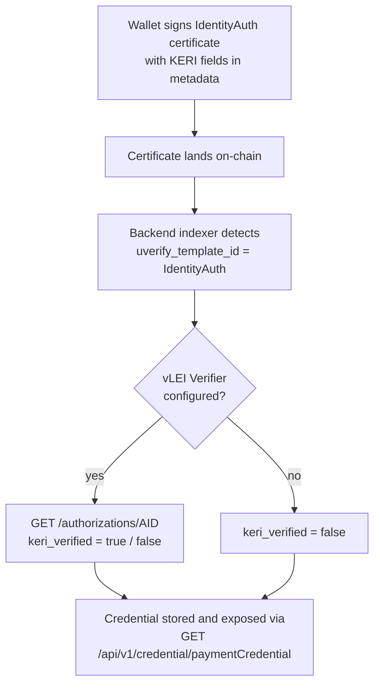

import { Callout } from 'nextra/components';

# Identity & Credentials

A Cardano address is pseudonymous. Anyone can verify that a certificate was signed by a specific wallet, but nothing on-chain says who controls that wallet. The UVerify identity system closes this gap by binding a [KERI](https://keri.one) identity to a Cardano payment credential, using a regular UVerify certificate as the public announcement.

Once a wallet has announced its identity, every certificate it issues can be traced back to a verifiable, revocable, cryptographically anchored identity. Templates can even require the issuer to hold a specific credential type before they become available.

## The building blocks

**KERI (Key Event Recovery Infrastructure)** is a decentralized key management system. An identity in KERI is an **AID** (Autonomic Identifier), a self-certifying identifier backed by a **KEL** (Key Event Log) that records every key rotation. A network of **witnesses** co-signs the KEL, and an **OOBI** (Out-of-Band Introduction) is a URL where anyone can discover and replay the KEL to verify the current keys.

**ACDC (Authentic Chained Data Container)** is the credential format built on KERI. An ACDC credential is issued by an AID against a published schema and can be chained to other credentials. The **vLEI** ecosystem (verifiable Legal Entity Identifiers, run by GLEIF) uses ACDC credentials to attest real-world organizational identity.

**vLEI Verifier** is a service that checks whether an AID holds a valid, non-revoked credential chain. The UVerify backend queries it to decide whether an announced identity is verified.

## How the binding works

The binding is announced with an **IdentityAuth certificate**: a standard UVerify certificate whose metadata carries the KERI identity fields and whose issuing wallet is the wallet being bound.

Because the AUTH certificate is signed by the wallet itself, the Cardano side of the binding is proven by the transaction signature. The KERI side is proven by the `p` field, a signature over `cardano:<paymentCredential>` made with the AID's current signing key. Together they show that the same actor controls both the wallet and the KERI identity.

Revocation works the same way: the wallet issues a second IdentityAuth certificate of type `REVOKE` that points at the original AUTH certificate hash. The indexer marks the credential as revoked and it disappears from the credential API.

## What it unlocks

- **Issuer identity on certificates.** A verifier no longer has to trust a bare address. The credential API resolves the wallet to its announced identity, including live vLEI verification status.
- **Credential-gated templates.** A custom template can set `requiredCredentials = ['identity']` (or any credential type such as `ISO9001` or `CE_Marking`). The template only appears in the creation UI when the connected wallet holds an active credential of that type.
- **Auditable lifecycle.** AUTH and REVOKE events are ordinary on-chain certificates, so the full history of an identity binding is publicly verifiable.

## In this section

- [IdentityAuth Certificate](./identity/identity-auth-certificate) — the metadata format, the credential REST API, and backend configuration
- [KERIA Sandbox Walkthrough](./identity/keria-walkthrough) — issue and revoke a fully verified identity credential against a local KERI stack

<Callout type="info">
  The identity system is available on every UVerify deployment. Without a configured vLEI Verifier the binding still works, but credentials are stored with `keriVerified: false`.
</Callout>
