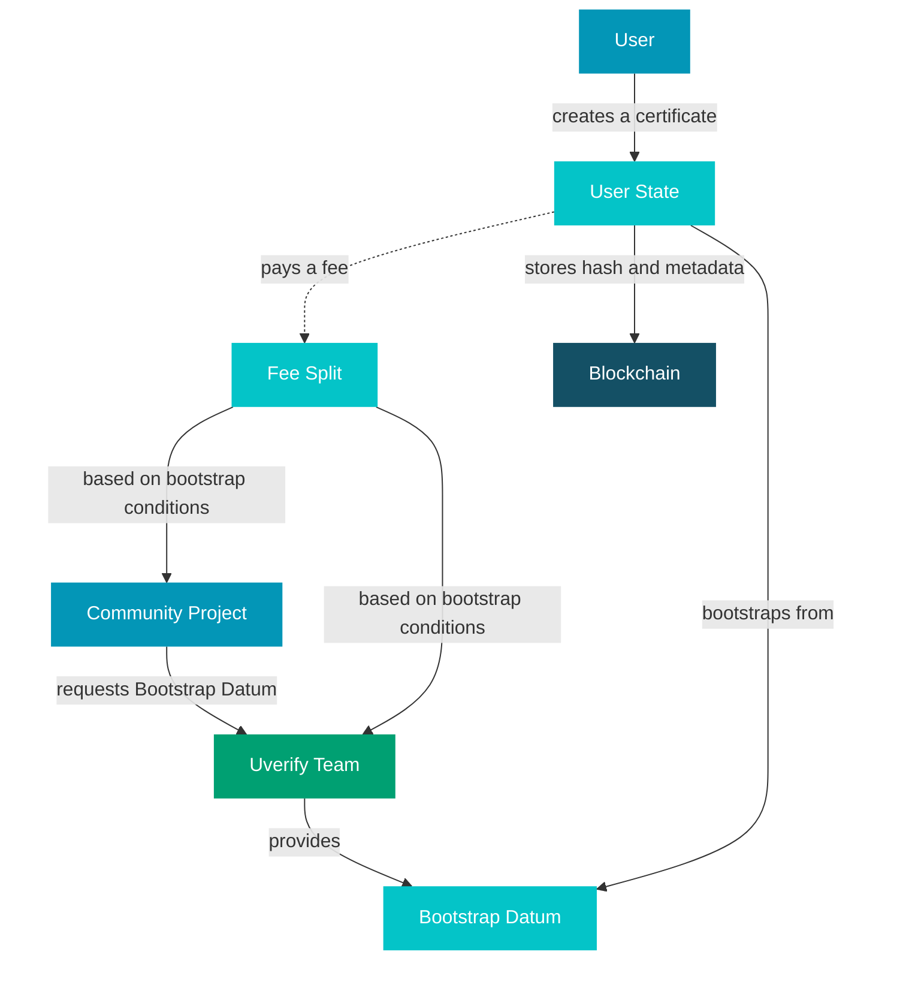

# UVerify as a Platform

Imagine a university student graduating after four years of hard work. They receive their diploma, but when they apply for a job abroad, the employer has no easy way to verify it's real. With UVerify, that diploma lives on the Cardano blockchain: permanent, tamper-proof, and verifiable by anyone in seconds, without calling the university.

That's just one example. UVerify handles academic credentials, product passports, laboratory reports, and attestations from private blockchains: anything where trust and permanence matter.

Welcome to **[UVerify.io](https://uverify.io)**.

## Before You Start

To create certificates on UVerify, you'll need:

- **A Cardano wallet** (e.g. Eternl, Lace, or Vespr)
- **ADA** to cover transaction fees. On mainnet, this means real ADA; on preprod, the Cardano testnet, you can grab free test ADA from the [Cardano Faucet](https://docs.cardano.org/cardano-testnets/tools/faucet/)

> **No ADA yet?** ADA is available on exchanges. If your organization faces regulatory barriers to acquiring ADA, reach out. We offer fee sponsorship for projects that are a good fit.

## What Makes UVerify Different?

Most platforms lock you into their branding and rules. UVerify flips that around.

You can spin up your own custom UVerify instance, complete with your own branding, certificate design, and fee structure, without building anything from scratch. The foundation is already here; you just make it yours.

This is powered by our **Bootstrap Datum** system. Think of a Bootstrap Datum like an API key we provision for you. It tells the platform who you are, how your certificates should look, and what rules apply when others use your setup: things like fee structure, batch size, and which certificate page templates are unlocked.

Out of the box, every user has access to a **default Bootstrap Datum**. It's a great way to get started, but it comes with standard settings: a batch size of 1, the platform's default fee structure, and no access to custom certificate page templates. If you want the full white-label experience, you'll want your own.

Here's what a custom Bootstrap Datum unlocks for you:

- **White-label certificates**: Your users create certificates that look and feel like they came from you. Your brand, your design, your domain.
- **Controlled access**: You decide who can use your Bootstrap Datum and under what conditions, whether that's a specific UI template, larger batch sizes, or custom fee rules.
- **Built-in monetization**: Every time someone creates a certificate through your Bootstrap Datum, you earn the service fee. You set the fee. You keep the earnings.

In short: you're not just a user of UVerify. You're running your own certificate service on top of it.

### How Bootstrap Datums and User States Work Together

When a user creates a certificate, a **User State** is derived from your Bootstrap Datum. Think of it as a personal session tied to the conditions of your Bootstrap Datum at the moment it was created.

This matters for two reasons:

1. **Stability**: Once a User State is created, its conditions are locked in. Even if you update or rotate your Bootstrap Datum, users with an active state can finish what they started under the original terms, with no surprises mid-flow.
2. **Continuity**: Bootstrap Datums come with a time-to-live (TTL) and a maximum transaction count. When these are consumed, the Datum needs to be renewed, but UVerify handles this automatically in the background, so neither you nor your users ever notice.

Here's how it all fits together:

## Why Partner With Us? 🌟

- **Your brand, your rules**: Full control over the look, feel, and fee structure of your certificate experience.
- **No reinventing the wheel**: The infrastructure is live and battle-tested. You can go from idea to launch fast.
- **You earn as it grows**: Your Bootstrap Datum works for you. Every certificate created through it puts fees in your pocket.
- **We grow together**: We're genuinely invested in your success and happy to work through the setup with you hands-on.

## Get in Touch 📬

Have a use case in mind? We'd love to hear it.

- [Email Us](mailto:hello@uverify.io)
- [Join Our Discord](https://discord.gg/Dvqkynn6xc)
- [Follow Us on X](https://x.com/UVer1fy)
- [Connect on LinkedIn](https://www.linkedin.com/company/uverify-io)