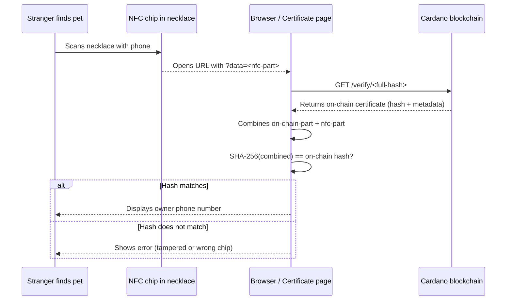

# Pet Necklace

This use case was discussed in depth during a Cardano Foundation open office hours session. If you prefer watching over reading, the full walkthrough is available here: [Cardano Foundation Open Office Hours (YouTube)](https://www.youtube.com/watch?v=Pvk8aat8PTQ)

## The Problem

A pet gets lost. A stranger finds it and wants to contact the owner. But how?

- A tag with the owner's phone number is a GDPR problem; it exposes personal data to anyone who looks at the tag
- A QR code pointing to a database with the owner's details requires the database provider to maintain infrastructure, comply with data protection laws, and stay online indefinitely
- A physical tag can be copied

The ideal solution: the phone number is not stored anywhere centrally. No server to hack, no database to breach, no infrastructure to maintain. But the phone number is still retrievable when the pet is found.

## How UVerify Solves It

The data needed to reveal the owner's phone number is **split between two places**:

1. **On-chain**: part of the data (stored in the certificate hash and metadata)
2. **NFC chip in the necklace**: the other part of the data (stored in the URL that the NFC chip broadcasts)

Only when both parts are combined does the SHA-256 hash match, and only then does the certificate page reveal the phone number. Neither piece alone is useful.

**The service provider needs zero infrastructure.** It is all UVerify.

## The Pattern: Split Secret



## GDPR Compliance

Under GDPR, personal data (a phone number) must be handled carefully. This pattern achieves compliance through a key insight: **no personal data is stored on any server**.

- The Cardano blockchain stores a hash, not personal data
- The NFC chip stores a URL fragment, not personal data
- The phone number is only reconstructable when both parts are present and the hash matches
- UVerify never stores or processes the phone number
- There is no database to breach

The data is self-sovereign: it lives with the pet's owner (who controls the necklace and knows the hash) and is accessible only to whoever has physical access to the necklace.

## Implementation

### Step 1: Split the data

Decide how to split the owner's information. A simple approach:

```js
const ownerPhone = '+49 151 12345678';
const onChainPart = ownerPhone.slice(0, Math.floor(ownerPhone.length / 2));
const nfcPart = ownerPhone.slice(Math.floor(ownerPhone.length / 2));

// The hash is computed from the full string
const fullHash = sha256(ownerPhone);
```

Or use a more sophisticated scheme: store a random salt on-chain, store the decryption key on the NFC chip, and encrypt the phone number with a key derived from both. The certificate page derives the key and decrypts when both parts are present.

### Step 2: Notarize

Record the hash (and any on-chain portion of the data) on Cardano. No phone number or personal data goes into the metadata.

```json
{
  "uverify_template_id": "default",
  "type": "pet-necklace",
  "pet_name": "Biscuit"
}
```

The template can be the default (reads the hash match result) or a custom template designed specifically for the pet necklace experience.

### Step 3: Program the NFC chip

Program the NFC chip in the necklace to broadcast a URL containing the `data` parameter:

```
https://app.uverify.io/verify/<full-sha256-hash>?data=<nfc-part>
```

When someone scans the necklace with their phone, the browser opens this URL. The certificate page extracts the `?data=` parameter, combines it with the on-chain portion, verifies the SHA-256 hash, and if it matches displays the owner's phone number.

### Step 4: No ongoing maintenance

Once the certificate is on-chain and the NFC chip is programmed, the service provider has nothing to maintain. The Cardano blockchain keeps the record. The NFC chip carries the URL. The certificate page is served by UVerify.

## Building the Service

A business offering pet necklaces as a product:

1. Provisions each necklace with a unique NFC chip
2. At purchase/registration, the owner provides their phone number
3. The service splits the data, computes the hash, notarizes it via the UVerify API (no wallet needed from the owner)
4. Programs the NFC chip with the URL
5. Ships the necklace

No ongoing server costs. No database to maintain. No GDPR headaches. The service fee per necklace covers all notarization costs, paid once at setup.

The service provider can white-label the certificate page with their own branding using a custom Bootstrap Datum. See [UVerify as a Platform](../platform).
