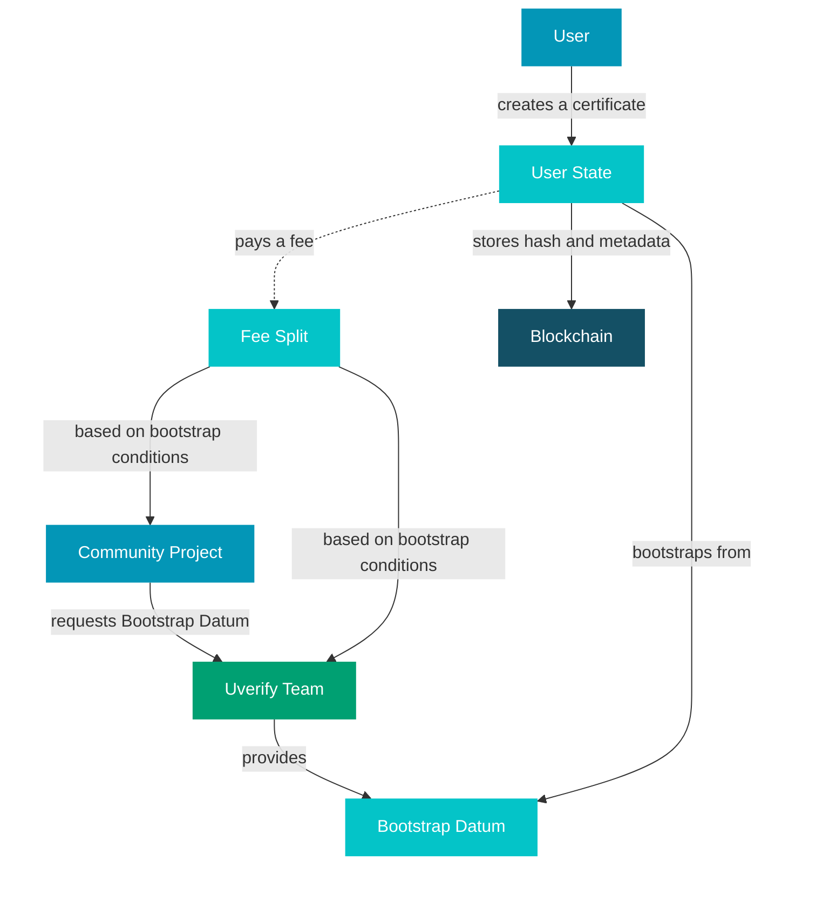

# Web3 Partnership System 🚀🤝

Welcome to <b>[UVerify.io](https://uverify.io)</b>, where we make it easy to create and share trusted, tamper-proof certificates. Whether you're looking to integrate UVerify into your project, build a custom certificate page for your users, or explore new ways to use blockchain technology, we're here to help.

## What Makes Our Web3 API Key Different?

In the Web2 world, an API key is just for you. But in Web3, our Bootstrap Datum (your Web3 API key) is much more powerful. Here's why:

- <b>Shareable Access</b>: You can allow others to use your Bootstrap Datum under specific conditions you define. For example, they can use your custom UVerify interface or batch sizes for certificates.
- <b>Earn Service Fees</b>: When others use your Bootstrap Datum, you'll earn the service fees they pay. You're in control of the fee structure and conditions.
- <b>Customizable</b>: Your Bootstrap Datum is tailored to your needs, including branding, certificate page design, and usage rules.
  This means you're not just using UVerify - you're creating a system that others can use, while you benefit from their activity.

Here's how it works:

### Benefits of Partnering with Us 🌟

- **Your Use Case, Your Earnings**: You'll earn the majority of the service fees.
- **White Label Certificate Page**: Unlock the potential of a fully customized certificate page tailored to your brand. We'll guide you through the setup process, ensuring it aligns perfectly with your unique needs.
- **Quick Start**: No need to reinvent the wheel! Start today with UVerify.io.
- **Collaborative Growth**: We're eager to hear from you and grow together.

### Get in Touch 📬

- [Email Us](mailto:hello@uverify.io)
- [Join Our Discord](https://discord.gg/Dvqkynn6xc)
- [Follow Us on X](https://x.com/UVer1fy)
- [Connect on LinkedIn](https://www.linkedin.com/company/uverify-io)

We're eager to hear from you. Let's build the future together!
