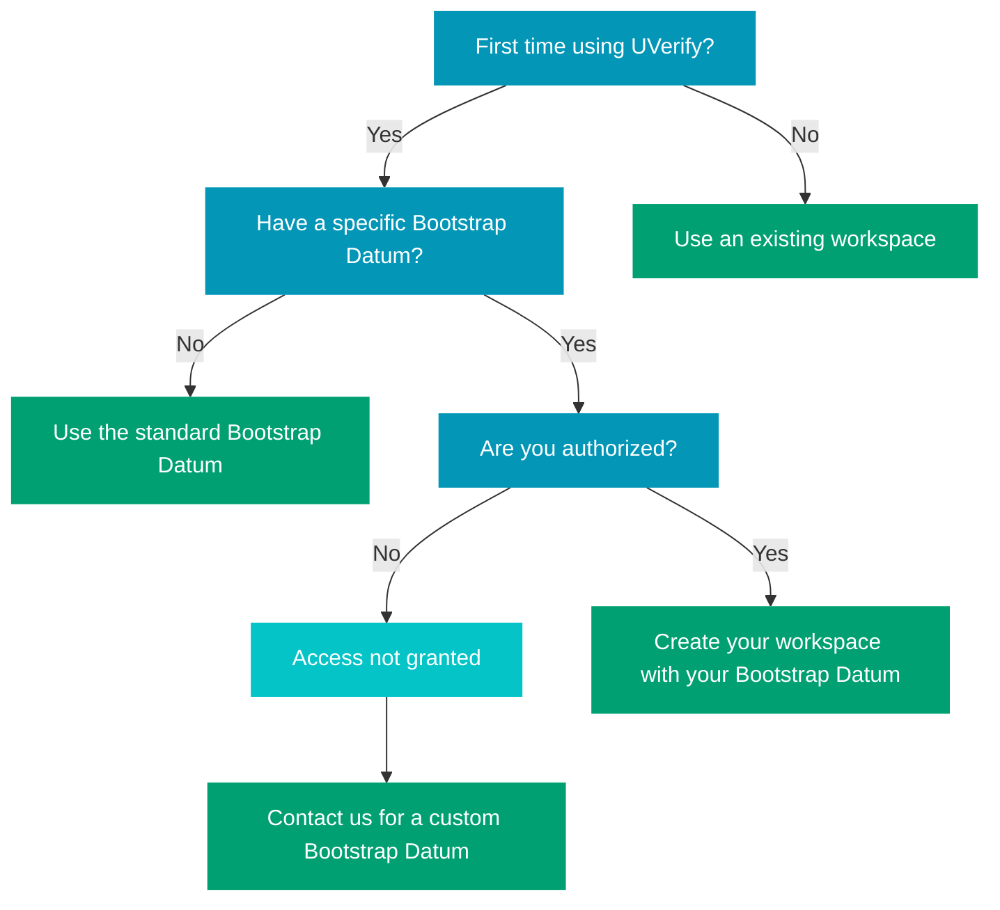

# Bootstrap Datum Overview 🚀

When someone wants to use UVerify to create certificates, they will need a State — a personal workspace that enables them to issue and manage certificates. This State is created by "forking" from a Bootstrap Datum, which acts like a Web3 API key.

The Bootstrap Datum defines the rules and conditions for using UVerify, such as fees, batch sizes, and who is authorized to use it. It's the foundation for enabling seamless certificate issuance while giving you control over how the system operates.
By creating a Bootstrap Datum, you're not just setting up your own certificate issuance system — you're also enabling others to use it under your terms, while you earn revenue from their activity.
This is the process of forking a new State from a Bootstrap Datum:



```rust
type BootstrapDatum {
  allowed_credentials: List<VerificationKeyHash>,
  authorization_token_script_hash: ByteArray,
  token_name: AssetName,
  update_token_contract_credential: ByteArray,
  fee: Int,
  fee_interval: Int,
  fee_receivers: List<VerificationKeyHash>,
  ttl: Int,
  transaction_limit: Int,
  batch_size: Int,
}
```

## Allowed Credentials 🔑

Provide us with a whitelist of payment credentials you wish to allow. An empty list means all credentials are permitted, giving you flexibility in managing access.

## Token Name 🏷️

The token name can be used as a condition to display a custom user interface for the certificate page.

## Fee 💰

This is the service charge applied on every fee interval.

## Fee Interval ⏱️

The interval at which the fee is charged. The Cardano blockchain operates on a UTXO model, and to prevent dust UTXOs, a minimum fee of 1 ADA is required. To avoid users paying 1 ADA or more per certificate, we charge the fee at regular intervals. The fee interval specifies the number of certificates after which the fee is applied.

## Fee Receivers 📥

The fee collected is distributed among the designated fee receivers, ensuring fair compensation for all parties involved.

## TTL (Time to Live) ⏳

This defines the lifespan of the bootstrap datum, measured in UNIX time, providing a clear timeline for its validity.

## Transaction Limit 🔄

Users can fork this bootstrap datum into a state datum. The transaction limit specifies the number of certificates after which the state token needs to be renewed, maintaining system efficiency.

## Authorization Token Script Hash and Update Token Contract Credential 🔒

These fields are internal references to the contract managing state updates. You can safely ignore them as they are handled automatically.

## Batch Size 📦

The number of certificates that can be issued in a single transaction. This helps reduce the fee cost per certificate.
